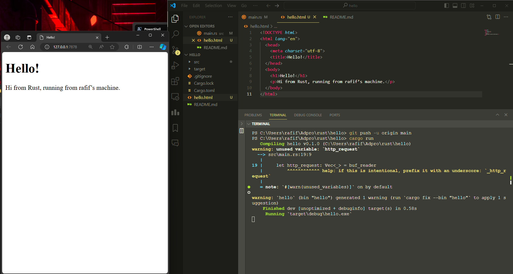

# Advanced Programming - Module 6

## Reflection 1

The Rust code is a simple TCP server that listens upcoming connections on port 7878.

Lines 10 to 27 define a function called handle_connection that takes a mutable reference to a TcpStream as a parameter. This function is responsible for handling a client connection.

On line 12, a BufReader is created using the TcpStream reference. BufReader is a type that provides buffered reading capabilities, which can improve performance when reading from a stream.

On line 13, a variable named http_request is declared as a Vec<_>. This vector will store the lines of the HTTP request received from the client.

The next few lines (lines 14 to 17) use method chaining to perform a series of operations on the buf_reader:
- lines() returns an iterator over the lines of the buf_reader.
- map(|result| result.unwrap()) maps each line to its unwrapped value, removing the Result type.
- take_while(|line| !line.is_empty()) takes lines from the iterator until it encounters an empty line.
- collect() collects the lines into a Vec<_>.

Finally, on line 19, the http_request vector is printed using println!(). The {:?} format specifier is used to print the vector in a debug format.

This code demonstrates a basic implementation of handling a client connection and extracting the lines of an HTTP request.

## Reflection 2

## Reflection 3

The provided code snippet processes client requests by first reading the request line. If the request is a GET method targeting the root path "/", it responds by sending the contents of the "hello.html" file. Otherwise, if the request method is not GET or the path is not "/", it returns a "404 Not Found" response. The refactoring aim is to streamline and minimize redundancy in the code.

## Reflection 4

The intentional use of the thread::sleep() function in response to a request line of GET /sleep HTTP/1.1 causes a delay of 10 seconds, resulting in slow loading.

## Reflection 5

In Rust, managing tasks concurrently typically involves employing a thread pool, which consists of pre-allocated worker threads. These pools efficiently handle asynchronous tasks, including parallelizing CPU-bound workloads and executing non-blocking I/O operations, thus easing the load on the main thread by utilizing channels to facilitate communication between the ThreadPool and Worker, with the receiver wrapped with Mutex to prevent race conditions and Arc to avoid borrowing conflicts.